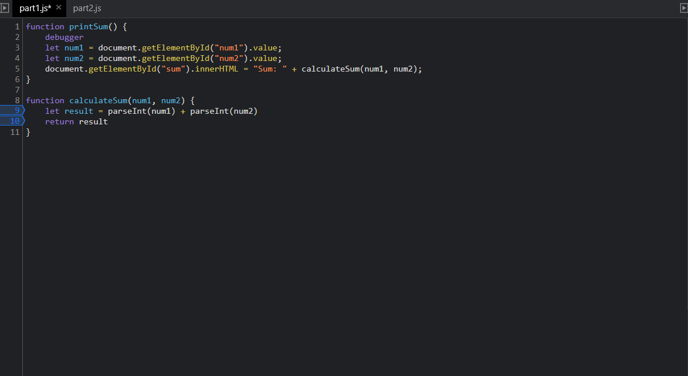

Debugging
1.) The bug in the site is that the num1 and num2 are passed as strings, so the addition concatenates them as strings and result is returned as a string.

2.) Typecasting num1 and num2 to ints within calculateSum should fix the issue.

Network

3.) The file is citylots.json
4.) The initiator was part2.js
5.) The file is 11.7 MB
6.) The file took 1.76s to download.
7.) Chrome/90.0.4430.85
8.) Server: Apache
9.) Tue, 26 Jan 2021 22:14:13 GMT
10.) application/json
11.) fetch('./citylots.json')